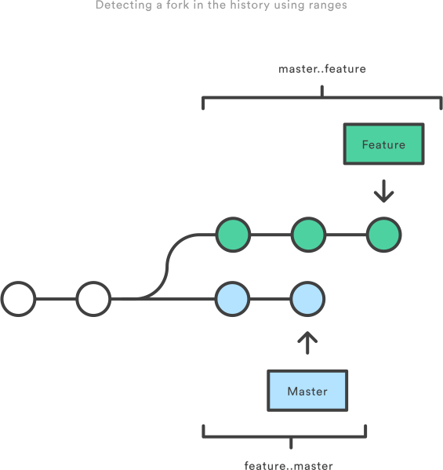

# COMMIT HISTORY

Per vedere la storia di un progetto il comando base è `git log`.

Se ad esempio eseguiamo la clone di un progetto:

`git clone https://github.com/schacon/simplegit-progit`

Se eseguiamo il comando `git log` su questo progetto, dovresti vedere qualcosa del tipo:

```
$ git log
commit ca82a6dff817ec66f44342007202690a93763949
Author: Scott Chacon <schacon@gee-mail.com>
Date:   Mon Mar 17 21:52:11 2008 -0700

    changed the version number

commit 085bb3bcb608e1e8451d4b2432f8ecbe6306e7e7
Author: Scott Chacon <schacon@gee-mail.com>
Date:   Sat Mar 15 16:40:33 2008 -0700

    removed unnecessary test

commit a11bef06a3f659402fe7563abf99ad00de2209e6
Author: Scott Chacon <schacon@gee-mail.com>
Date:   Sat Mar 15 10:31:28 2008 -0700

    first commit
```

Per vedere le differenze introdotte in ogni commit, c'è l'opzione `-p`. Puoi usare anche l'opzione `-N` per vedere solo le ultime `N` commit.

```
$ git log -p -2
commit ca82a6dff817ec66f44342007202690a93763949
Author: Scott Chacon <schacon@gee-mail.com>
Date:   Mon Mar 17 21:52:11 2008 -0700

    changed the version number

diff --git a/Rakefile b/Rakefile
index a874b73..8f94139 100644
--- a/Rakefile
+++ b/Rakefile
@@ -5,7 +5,7 @@ require 'rake/gempackagetask'
 spec = Gem::Specification.new do |s|
     s.platform  =   Gem::Platform::RUBY
     s.name      =   "simplegit"
-    s.version   =   "0.1.0"
+    s.version   =   "0.1.1"
     s.author    =   "Scott Chacon"
     s.email     =   "schacon@gee-mail.com"
     s.summary   =   "A simple gem for using Git in Ruby code."

commit 085bb3bcb608e1e8451d4b2432f8ecbe6306e7e7
Author: Scott Chacon <schacon@gee-mail.com>
Date:   Sat Mar 15 16:40:33 2008 -0700

    removed unnecessary test

diff --git a/lib/simplegit.rb b/lib/simplegit.rb
index a0a60ae..47c6340 100644
--- a/lib/simplegit.rb
+++ b/lib/simplegit.rb
@@ -18,8 +18,3 @@ class SimpleGit
     end

 end
-
-if $0 == __FILE__
-  git = SimpleGit.new
-  puts git.show
-end
\ No newline at end of file
```

Se vuoi vedere statistiche abbreviate delle varie commit puoi usare `--stat`. Ad esempio:

```
$ git log --stat
commit ca82a6dff817ec66f44342007202690a93763949
Author: Scott Chacon <schacon@gee-mail.com>
Date:   Mon Mar 17 21:52:11 2008 -0700

    changed the version number

 Rakefile | 2 +-
 1 file changed, 1 insertion(+), 1 deletion(-)

commit 085bb3bcb608e1e8451d4b2432f8ecbe6306e7e7
Author: Scott Chacon <schacon@gee-mail.com>
Date:   Sat Mar 15 16:40:33 2008 -0700

    removed unnecessary test

 lib/simplegit.rb | 5 -----
 1 file changed, 5 deletions(-)

commit a11bef06a3f659402fe7563abf99ad00de2209e6
Author: Scott Chacon <schacon@gee-mail.com>
Date:   Sat Mar 15 10:31:28 2008 -0700

    first commit

 README           |  6 ++++++
 Rakefile         | 23 +++++++++++++++++++++++
 lib/simplegit.rb | 25 +++++++++++++++++++++++++
 3 files changed, 54 insertions(+)
 ```

 ## Oneline

 `git log --oneline`

 Esempio output:
 ```
    0e25143 Merge branch 'feature'
    ad8621a Fix a bug in the feature
    16b36c6 Add a new feature
    23ad9ad Add the initial code base
```
## Decorate

Per sapere a quale branch o tag una commit è associata, utilizza l'opzione `--decorate`.

Ad esempio:
`git log --oneline --decorate`

```
0e25143 (HEAD, master) Merge branch 'feature'
ad8621a (feature) Fix a bug in the feature
16b36c6 Add a new feature
23ad9ad (tag: v0.9) Add the initial code base
```

## Diffs

Le due opzioni più utilizzata, come già visto, sono `-p` e `--stat`.

`--stat` mostra la statistica delle modifiche, il numero delle insertion e deletion, di ogni file che è stato committato. Nota che una modifica di una linea è rappresentata da 1 insertion e 1 deletion.

Ad esempio la seguente commit del file `hello.py` ha aggiunto 67 linee e cancellato 38.

```
commit f2a238924e89ca1d4947662928218a06d39068c3
Author: John <john@example.com>
Date: Fri Jun 25 17:30:28 2014 -0500

 Add a new feature

 hello.py | 105 ++++++++++++++++++++++++-----------------
 1 file changed, 67 insertion(+), 38 deletions(-)
 ```

 Se vuoi vedere i cambiamenti puntuali di ogni commit utilizza l'opzione `-p` di git log.

```
commit 16b36c697eb2d24302f89aa22d9170dfe609855b
Author: Mary <mary@example.com>
Date: Fri Jun 25 17:31:57 2014 -0500

 Fix a bug in the feature

diff --git a/hello.py b/hello.py
index 18ca709..c673b40 100644
--- a/hello.py
+++ b/hello.py
@@ -13,14 +13,14 @@ B
-print("Hello, World!")
+print("Hello, Git!")
```

## Shortlog

Il `git shortlog` è un caso speciale del `git log` utilizzata per creare un release announcement. Raggruppa ogni commit per autore e mostra la prima linea messaggio del commmit.

Esempio:

```
Mary (2):
 Fix a bug in the feature
 Fix a serious security hole in our framework

John (3):
 Add the initial code base
 Add a new feature
 Merge branch 'feature'
 ```

 ## Graps

L'opzione `--graph` mostra un grafo ASCII rappresentante la struttura dei branch della commit history.

`git log --graph --oneline --decorate`

Un repository con due branch:

```
* 0e25143 (HEAD, master) Merge branch 'feature'
|\ 
| * 16b36c6 Fix a bug in the new feature
| * 23ad9ad Start a new feature
* | ad8621a Fix a critical security issue
|/ 
* 400e4b7 Fix typos in the documentation
* 160e224 Add the initial code base
```

## Custom formatting

`git log --pretty=format:"%cn committed %h on %cd"
`

## Filtri sulla commit history

### By Amount

`git log -3`

### By Date

`git log --after="2014-7-1"`

`get log --after="yesterday"`

`git log --after="2014-7-1" --before="2014-7-4"`

### By Author

`git log --author="John"`

Cerca i commit con autori _John_ o _Mary_.

`git log --author="John\|Mary"`

### By Message

`git log --grep="JRA-224:"`

### By File

`git log -- foo.py bar.py`

### By Content

`git log -S"Hello, World!"`

### By Range

`git log <since>..<until>`

con <since> e <until> che sono commit reference. 

Ad esempio:

`git log master..feature`



### Filtering Merge Commits

`git log --no-merges`

`git log --merges`

------------------------------

 ### REFERENZE

 https://www.atlassian.com/git/tutorials/git-log

 https://git-scm.com/book/en/v2/Git-Basics-Viewing-the-Commit-History


