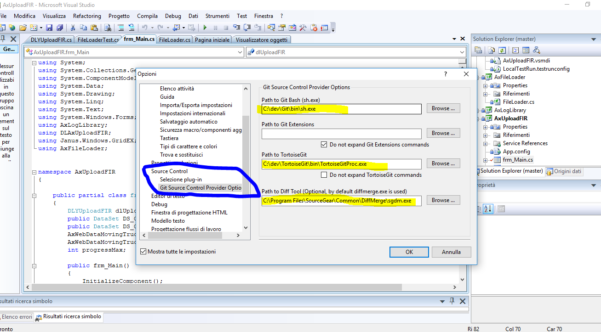

# GIT per VisulaStudio - Git Source Control Provider

## Visual Studio 2008 e >

[Git Source Control Provider](https://marketplace.visualstudio.com/_apis/public/gallery/publishers/yysun/vsextensions/GitSourceControlProvider/1.3/vspackage)

Vedi le varie versioni, in particolare VS 2008

[Documentazione plugin](http://gitscc.codeplex.com/wikipage?title=Installation&referringTitle=Documentation)

## CONFIGURARE IL PLUGIN

Da menù VS, sotto Strumenti -> Opzioni - > Source Control 

Per configurare i path dei software su sui si basa il plugin di Visual Studio.

### INSTALLAZIONE DIFF MERGE
https://sourcegear.com/diffmerge/

C:\Program Files\SourceGear\Common\DiffMerge\sgdm.exe

## SOFTWARE SCARICATO

Su PC103 `\\PC103\Programmi Ufficio\GIT`

 - Git-2.13.1.2-64-bit (git) https://git-scm.com/downloads
 - GitSccProvider.exe (plugin GIT per VS 2018)
 - TortoiseGit-2.4.0.2-64bit, una window shell interface to git, https://tortoisegit.org/ 
 - DiffMerge_4.2.0.697.stable_x64 [DiffMerge](https://sourcegear.com/diffmerge/)
 - SourceTreeSetup-2.1.2.5 (client git grafico) vedi [Gui clients](https://git-scm.com/downloads/guis)